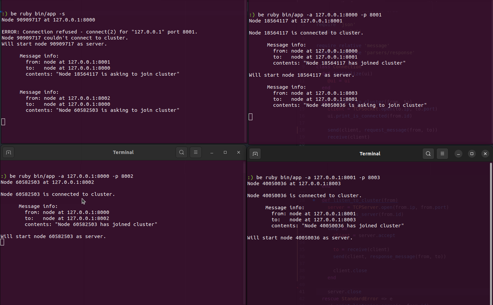

[](https://gitlab.com/octopusinvitro/distributed-ping-pong/commits/main)
[](https://codeclimate.com/github/octopusinvitro/distributed-ping-pong/test_coverage)
[](https://codeclimate.com/github/octopusinvitro/distributed-ping-pong/maintainability)
[](https://depfu.com/github/octopusinvitro/distributed-ping-pong?project=Bundler)

# Readme

My first distributed system. I read somewhere that the "hello world" of distributed systems is ping pong.


## How to use this project

This is a Ruby project. Tell your Ruby version manager to set your local Ruby version to the one specified in the `Gemfile`.

For example, if you are using [rbenv](https://cbednarski.com/articles/installing-ruby/):

1. Install the right Ruby version:
  ```bash
  rbenv install < VERSION >
  ```
1. Move to the root directory of this project and type:
  ```bash
  rbenv local < VERSION >
  ruby -v
  ```

You will also need to install the `bundler` gem, which will allow you to install the rest of the dependencies listed in the `Gemfile` of this project.

```bash
gem install bundler
rbenv rehash
```


### Folder structure

* `bin `: Executables
* `lib `: Sources
* `spec`: Tests


### To initialise the project

```bash
bundle install
```


### To run the app

Make sure that the `bin/app` file has execution permissions:

```bash
chmod +x bin/app
```

Then just type:

```bash
bin/app
```

If this doesn't work you can always do:

```bash
bundle exec ruby bin/app
```

The app tries ot connect the node to a server if any and then starts the node as a server too. This will print the IP and port of the server node. You can then use that to connect to it from another machine. Use `-a` to set IP and port to connect to, and `-p` to set port of the node who wants to connect. Say the server is listening at `127.0.0.1:8000`, and you want your node to be on port `8001`:

```bash
bin/app -a 127.0.0.1:8000 -p 8001
```

You can see all options if you print the help:

```bash
bin/app -h
```


> Example of nodes sending and receiving messages on the same machine.

## Tests


### To run all tests and rubocop

```bash
bundle exec rake
```


### To run a specific test file


```bash
bundle exec rspec path/to/test/file.rb
```


### To run a specific test

```bash
bundle exec rspec path/to/test/file.rb:TESTLINENUMBER
```


### To run rubocop

```bash
bundle exec rubocop
```


## License

[](https://opensource.org/licenses/mit)
MIT License
